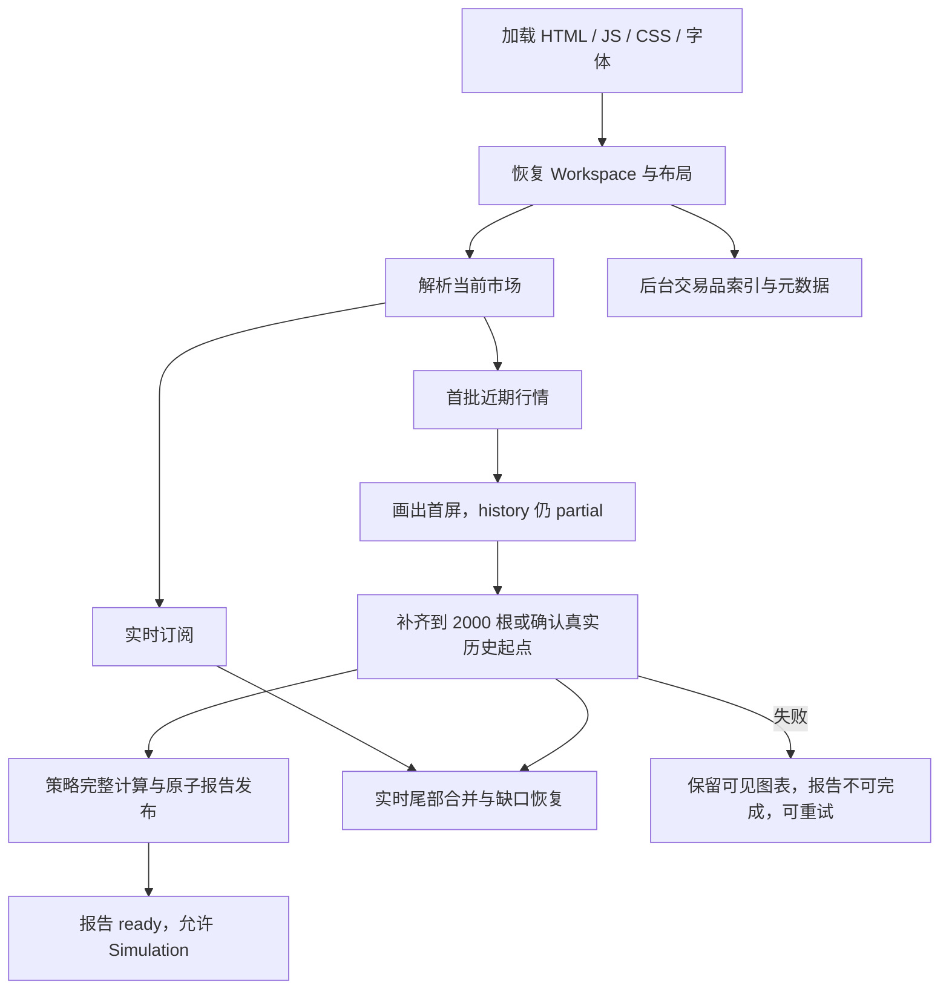

# 首次加载与行情初始化优化计划

日期：2026-10-02。代码基线：`93b5281`。工作分支：`feature/startup-loading-optimization`。

状态：执行中。默认历史、渐进加载、Worker 懒加载、存储降级、Provider 去重/短 TTL 和主要回归门禁已落地；长时 Provider、D-01 动态边界、真实制品 rollback 及完整线上验收仍未关闭。本文件同时记录执行状态，不替代独立性能报告。

## 1. 目标与边界

在保留默认 2000 根历史、既有 Workspace 行为和回测真实性的前提下，缩短首次图表可见时间、降低无关网络等待与首屏资源成本。

- 新旧用户均不需要清理缓存；保留品种、周期、布局、绘图、自建脚本、收藏、指标参数及模板。
- 首屏可见不等于回测完成；历史未完整时不得发布最终结果或开放 Simulation。
- 同一确定数据集下，优化前后 OHLCV、指标、逐笔交易、权益曲线和 KPI 必须一致。
- 优化针对浏览器加载，不能把开发服务启动的 fork 构建耗时混入页面性能。
- 不改变交易撮合语义，不借本任务实施 Replay、策略算法或整套 UI 重设计。
- 不修改 `node_modules`；优先应用集成层公共 API。需要新增 Vela fork 时先记录必要性、成本与验证结果，不能偷偷补丁依赖产物。
- 本轮交付为新分支和可执行方案。执行阶段依照下列任务自主排障、复测；无权限新增的外部基础设施不作为默认前提。

## 2. 已核验事实与先前说明的修正

| 事实 | 源码依据 | 对设计的影响 |
| --- | --- | --- |
| 默认 BTCUSDT / 15m / 2000 根，开启实时 | `src/config/workspace-options.ts` | 优化不减小最终历史深度 |
| 旧 Workspace 读取时迁移深度 | `src/integrations/storage/workspace-storage.ts` | 保护原配置并补充存储异常测试 |
| 当前同时注册 Binance、Hyperliquid，默认裸 ticker 需解析 | `src/integrations/vela/create-workspace.ts`、`provider-registry.ts` | 验证显式路由能否绕开索引等待，不删除 Provider |
| Binance 原生周期 2000 根通常两次串行分页 | Vela 0.7.7 `providers/binance.js` 的 `fetchKlines/paginateBackward` | 请求量与延迟分别测量；不能宣称翻四倍 |
| 45m/180m 会获取低周期后聚合 | 同上 `getBars/selectSubTf` | 2000 目标可能请求 6003 根底层数据；必须测试聚合边界 |
| 可用历史不足会提前终止 | 同上分页逻辑 | 周/月周期不可能保证取得几十年、几百年不存在的行情 |
| Vela 优先尝试渐进接口，Provider 未实现时返回 null 走普通加载 | Vela `ProviderFeed.loadProgressive`、`EngineOrchestrator.loadMarketInner` | 可以从公共 `getBarsProgressive` 能力着手；2000 根并非自动先画 300 根 |
| 深历史普通路径阈值为 >5000；有 loadRange 时先取最多 10000 根 | 同上 `SINGLE_LOAD_BARS/CHUNK_BARS/PREVIEW_BARS` | 不能把 PREVIEW_BARS=300 当作所有路径的首屏策略 |
| 渐进 Provider 抛错会被 ProviderFeed 转成空数组 | 同上 `loadProgressive` catch | 新能力会触及历史完成/错误语义，必须先做故障原型，不能直接上线 |
| 已有共享内存 BarStore、覆盖检查、缺口/尾部补取 | Vela `CachedDataFeed`、`ProviderRegistryFeed` | 不再建立重复且无边界的行情缓存 |
| Highcharts 和 highcharts-more 已动态导入 | `src/features/backtesting/highcharts-renderer.ts` | 不把已有拆包列为新收益；调查何时实际触发加载 |
| 引擎实例按 Cell 管理，Workspace 销毁时 terminate | `src/integrations/pinets/create-engine.ts` | 不跨已销毁 Workspace 留 Worker；复用要遵守现有生命周期 |
| PineWorkerEngine 构造只保存 spawn，实际 Worker 在需要时懒创建 | `packages/vela-pinets/src/pinets-worker/PineWorkerEngine.ts` | 不把“提前启动所有 Worker”当作现有瓶颈；测实际 prepare/execute 成本 |
| predev 已有 fork 产物缓存检查 | `scripts/ensure-fork-build.mjs`、`package.json` | 无需重复添加 dev:fast |

上述为源码事实，真实耗时、关键路径比例和跨设备收益仍需测量。不能把 HTTP 200 或现有测试数当作浏览器功能证明。

## 3. 测量与目标链路



这是优化目标图，不是当前精确事件时序。实时订阅可能与补历史重叠，必须处理快照覆盖实时尾部的问题。`visibleRange`、离线数据、热缓存及多 Cell 单独保留原生路径。

### 3.1 观测指标

以 navigation start 为统一原点；增加仅开发/诊断模式启用的计时器，不输出脚本源码、账户、持久化内容。

| 指标 | 采集点/证据 |
| --- | --- |
| 首次界面可操作 | Workspace 挂载后真实按钮点击成功 |
| 首根行情可见 | Canvas 实际有数据 + chart 数据数，不用 `load:end` 单独代替 |
| 全历史完成 | reason-bearing history 事件 + 数量/边界/请求成功证据 |
| 首次完整报告 | ledgerRevision/runToken 对齐，账本、曲线、KPI 可复算 |
| 网络成本 | 每个 venue/endpoint 请求数、字节、首尾响应、重试、取消 |
| 主线程/内存 | 长任务、脚本解析、渲染、Worker 数和销毁后资源回收 |
| 下载成本 | production 首屏实际请求的 JS/CSS/字体 gzip 总量，而非只看单个 chunk |

基线与优化版在同机同浏览器按 ABBA 顺序各至少 20 次；分别记录冷 HTTP 缓存、热 HTTP 缓存、新页面、页内暖数据缓存；原始样本和异常样本均留存，不任意剔除失败。

受控网络场景固定每请求延迟、带宽和确定 OHLCV，记录 median/p95；真实 Binance/Hyperliquid 单独报告，不将网络抖动归因于代码。慢网、断网不是伪造数据后宣布通过。

初始验收预算（须在实现前用基线验证可测性，不能事后为过测放宽）：

- 渐进方案冷 2000 根首屏 median 改善至少 20%，p95 不回退；否则继续调批大小或不启用该策略。
- 全历史/完整报告 median、p95 相对回退不超过 10%；不得靠首屏变快掩盖最终计算显著变慢。
- 常规原生 Binance 冷 2000 根行情请求上限从 2 次增至最多 3 次（若选择 500+1000+500）；无重复全量补取。
- 热路径耗时及内存相对基线回退不超过 10%；单元/确定性结果零差异。
- 资源拆分目标为 production 首屏实际 JS gzip 至少下降 15%；若无收益则不合入仅移动 chunk 名称的改动。
- 性能门禁区分网络失败率、渲染失败率及结果不完整率；任何账本错误为硬失败，不允许性能指标抵消。

## 4. 实施任务与依赖

### P0 / S0：基线与前置可靠性

1. 新增 `tests/startup_loading.py`（建议名），对真实 App 执行网络时间线、首屏和最终报告观测；支持 dev/preview、三浏览器、独立临时端口和 profile。
2. 新增存储边界测试：读取 `window.localStorage` getter 抛错、get/set/remove 抛错、quota、坏 JSON、多 Cell、缺省/500/2000/>2000、绘图中的同名 bars 字段。
3. 修复当前存储适配器创建时可能因 SecurityError 阻断 Workspace；存储不可用则会话内继续，禁止清空其他用户数据。将默认深度与迁移阈值统一来源，并明确现行“至少 2000”策略。
4. 对真实 Vela 恢复路径验证迁移生效，而非只对 JSON 函数做断言。
5. 固化源码/锁文件/构建版本、完整数据与基线报告散列；数据和性能附件仅存 `audit-evidence/startup-loading/`（已忽略）。

交付：可复跑基线、存储故障防护、观测脚本。S0 通过后再修改加载路径。

### P1 / S1：市场路由与索引解耦

修改候选：`create-workspace.ts`、`provider-registry.ts`；必要时新增独立路由模块。

- 已完成受控浏览器验证：默认 `binance:BTCUSDT` 在 2s 索引延迟时比裸 `BTCUSDT` 首绘提前约 1.07s；接入后仍需完成完整品种搜索及存储/模板兼容回归。
- 不把所有 BTCUSDT 强行迁移为 Binance：已显式指定的 venue 和未知裸 ticker 保持原行为。
- 索引仍注册且可恢复；保留 30 秒 fallback、onIndexRecovered、online 重试。先解除阻塞，不为减少请求删除交易品选择器能力。
- 若索引后台并发不阻塞，不做无收益的“延迟所有索引”；仅在测量表明确有竞争时通过公共注册机制延迟非当前 Provider。
- 元数据影响 syminfo/mintick，不能用假精度抢先启动策略后静默改结果。

验收：阻断非当前 venue 索引时当前 BTCUSDT 能显示；品种搜索最终完整、恢复正确；Spot/Futures/Hyperliquid 均能切换。

### P1 / S2：渐进行情原型 → 安全启用

修改候选：新增 `src/integrations/vela/provider-progressive.ts`，接入 `provider-registry.ts`，复用 `provider-history.ts`、`provider-network.ts`、`workspace-history-observer.ts` 的错误事实链。

1. 先以真实 Vela + 可控 Provider 证明首屏、回调、异常、取消、history 完成的实际契约。重点证明 ProviderFeed 吞错后适配器仍禁止 ready；无法证明时不得开启生产路径。
2. Binance 原生周期：优先原型为 1000+1000（两请求、第一页即可显示），并对比 500+1000+500（三请求）。Vela FIRST_PAINT_BARS 为20，无需修改首画阈值；以首屏和完整报告双指标选择，不把“500”写死成不可讨论要求。
3. 历史分页严格用最早 open time - 1 作为上界；回调提供累计、递增、去重后的快照，末页不足时核验真实 genesis，错误不能作为 genesis。
4. 45m/180m：先按目标周期分桶设计窗口，再处理首尾非完整聚合；最终数据与旧整批算法逐字段相等后才启用。否则该周期继续走原路径并记录范围。
5. Hyperliquid 单次窗口已能获取 2000 根；只有测量证明拆成两次更优才渐进化，不能机械增加 REST 开销。
6. 尊重 AbortSignal；取消订阅者不能取消其他 Cell 共用请求。底层暂不可真正 abort 时至少阻断后续分页与迟到发布，并明确剩余请求成本。
7. 首批期间保持 history backfill；策略全历史计算只在最终完成后执行，不先做一次昂贵的 500 根策略再重复跑 2000 根。
8. 保留最后实时尾部；不允许旧历史覆盖更晚 websocket bar。正在形成的 K 线单独处理。
9. `visibleRange`、offline、warm-cache、向左拖动、>5000 深历史均测试；不通过重复 `setMarket(500)` → `setMarket(2000)` 模拟补齐。

回退：独立开关关闭渐进层后回到现有 Provider.getBars 和 Vela 生命周期；不能关闭错误门控“救活”报告。如果公共接口无法正确表达完成/失败，记录最小 Vela fork 需求并隔离实施；不要悬置任务或谎报成功。

### P2 / S3：请求去重（以测量发现为准）

- 先查 Vela 暖缓存、symbol index Promise 复用已有覆盖；仅对实际重复 in-flight 请求增加有界去重。
- key 至少包含 provider、真实 endpoint、ticker、timeframe、session、from/to、limit 和返回形态；失败移除、finally 释放、数量上限。
- 每个 Cell 保留独立请求/错误身份，跨 Cell 不串 history 事实。取消一个 consumer 不影响其他 consumer。
- 暂不引入持久化行情数据库；元数据短 TTL 缓存需明确 schema、venue、过期恢复、禁用存储降级和变更刷新，只有确有收益才纳入实现。

### P2 / S4：首屏资源和计算开销

- 以 production waterfall 确认 Highcharts 是否被隐藏面板提前触发，优先延迟实际 mount，而不是重复拆包。
- 检查 `create-app.ts` 静态导入的编辑器/回测模块和 `src/scripts/library/index.ts` 全量 raw 脚本；选择收益最大的独立功能边界懒加载。
- 异步 feature mount 必须支持 loading/error/retry、早到事件、destroy 后不挂载；保留原有同步宿主 API 或提供兼容入口。
- 引擎 factory 当前为同步契约，不能直接返回 Promise；若延迟 Worker 资源需在 prepare 边界或明确加载前置层实现，保持每 Cell 隔离。
- 不跨 workspace 销毁复用 Worker；不假定可以把“最近 500 根状态”向更早历史续算。一般 Pine 回溯补历史须重算完整时间序列。
- 不按显示 tab 改变核心账本/KPI语义；可延迟纯展示性 Analysis/Simulation 图表计算。

### P3 / S5：整合与交付

- 各阶段单独提交，问题先复现→修复→新增防回归→复跑，不修改断言来掩盖非预期。
- 组合开启优化与全部关闭优化分别测试；开关仅影响性能路径，不改变数据正确性标准。
- 构建后执行真实生产页面 smoke、离线静态资源检查、完整功能回归；不能以 dev 通过代替生产包。
- 创建带 commit 的 release manifest，使用 `release:verify --help` 确认参数后验证；模拟旧/新制品切换和浏览器缓存恢复，保留相同 Workspace 和脚本。
- 最终启动单一人工验收服务并报告地址/commit；只清理本轮拥有的进程，不停止用户其他服务。

## 5. 测试矩阵与硬性不变量

| 层级 | 必测场景 | 通过依据 |
| --- | --- | --- |
| 单元 | 分页边界、去重排序、空页/不足页、聚合、超时/429/503/非法响应、Abort、存储异常 | 完整 OHLCV 字段、错误身份、回调顺序断言 |
| 真实引擎集成 | PineEngine + PineWorkerEngine；同数据优化开/关 | 所有交易 entry/exit/size/P&L/MFE/MAE、曲线和 KPI 机器比较；不只比净利润 |
| 生命周期 | 快切市场/周期、hide/show、迟到响应、多 Cell、历史完成后加策略、destroy、Retry | 无旧 run/revision/epoch 覆盖，无 partial→假 ready |
| 行情网络 | 原生 1m/15m/1h/1D；聚合45m/180m；Spot/Futures/Hyperliquid；forming bar | 请求量/边界正确，最终数据一致，真实网络证据独立记录 |
| 错误恢复 | 首批成功后失败、索引失败、WS无数据/重连、断网恢复、metadata失败 | 图表可保留，结果标明未完成且禁用 Simulation；Retry 可恢复 |
| 主界面回归 | 工具栏、品种、周期、时区、布局、指标 on-chart/收藏/个人/内置、源码、脚本保存、模板、截图、编辑器、绘图 | 实际鼠标和键盘操作，不只检查 DOM 存在 |
| 回测 UI | Dock、Viewer 四 Tab、Settings 合并提交/焦点、Simulation、交易定位 | 原流程和可访问性不退化 |
| 状态恢复 | 全新页面、旧 Workspace、多个窗口、模板恢复、热/冷缓存 | 无数据丢失、深度正确、存储失败不阻塞启动 |
| 浏览器 | Chromium/Firefox/WebKit，桌面/窄屏；dev+preview | 新增真实主 App 场景；已有跨浏览器 fixture 不等于完整主 App 验收 |
| 资源与发布 | 重复挂载销毁、30次切换、长任务、实际下载量、旧制品回滚 | 无持续增长的监听器/Worker/请求，版本明确，资产一致 |

关键不变量：报告必须同 market + run + revision；历史失败不允许模拟；完整历史与正在形成的 bar 区分；无数据与接口失败区分；多 Cell 独立；计算结果不因首屏批次大小改变。

已有命令继续执行（先读脚本参数和前置条件，测试/构建顺序运行，不竞争资源）：

```sh
npm test
npm run test:regression:existing
npm run test:forks
npm run build
npm run check:dependencies
npm run check:dist:independence
npm run test:e2e
npm run test:e2e:settings
npm run test:e2e:fault-isolation
npm run test:e2e:multicell
npm run test:e2e:cross-browser
npm run test:e2e:prod
npm run test:e2e:performance
npm run test:providers
npm run test:visual:a11y
npm run test:e2e:offline
npm run test:e2e:kill-switch
git diff --check
```

kill-switch 测试后重新进行普通 production build，避免遗留禁用回测的 dist。新增启动测试必须运行实际 App；受控行情用于确定性和故障时序，真实网络 smoke 用于证明真实接入，两者不可互相替代。外部网络失败记录为未验证，不算 PASS；重复失败先诊断 endpoint/网络再重试。

## 6. 自动推进与完成标准

执行顺序：S0 → S1 → S2 → S3/S4 → S5。S3/S4 可并行研究，但共享生命周期改动必须整合后重新验证。

| 任务 | 当前状态 | 完成证据 |
| --- | --- | --- |
| 新分支、基于代码的计划 | 已完成 | 分支与本文件 |
| S0 基线、观测和可靠性 | 部分完成 | `tests/startup_loading.py`；显式/裸路由、2s 索引延迟、存储 getter 故障实际浏览器证据；仍需完整多轮冷/热样本 |
| S1 路由和索引 | 部分完成 | 默认 Binance 显式路由，受控首绘提前约 1.07s；仍需完整品种搜索、模板及所有 Provider 回归 |
| S2 渐进加载 | 部分完成 | Binance 原生 2000 根 progressive 模块、错误/取消/分页单测及真实 App 2×1000 请求；仍需真实首批策略门控、双引擎逐笔等价与长链路故障证据 |
| S3 去重 | 已完成（有界缓存） | `provider-network.ts` 对 Binance JSON 和 Hyperliquid POST 做 provider-instance 级并发去重，并对 exchange metadata 使用可配置短 TTL；`provider-registry.ts` 对 symbol index 使用同一实例隔离 TTL。失败自动释放并可重试，29 项网络测试通过；受控启动中 Binance `exchangeInfo` 从 4 次降至 2 次，历史 K 线请求仍保持 2 次 |
| S4 资源延迟加载 | 基线门禁通过，仍需长期观测 | Pine Worker 独立懒加载 chunk；主 JS 约 3.71MB 降至 2.27MB，Worker 约 825KB；跨浏览器、性能门禁和视觉/a11y 门禁通过，仍保留大 chunk 告警和长时资源观测项 |
| S5 组合回归/回滚/人工入口 | 部分完成 | 根测试 445/445、Vela-PineTS 283/283、开发/生产 E2E、Settings、故障隔离、多 Cell、跨浏览器、性能和视觉/a11y 均通过；仍需人工线上入口、长时 Provider/断网恢复、真实制品 rollback 验收 |

发现问题自主处理，不因一个失败路径停下；仍保留待办直到证据关闭。不可用“413/414 等历史测试数量”推断完成。性能无收益则自动调整方案或撤回该项代码，保留测量结论；业务回归必须修复后再前进。

当前已通过：根测试 441/441、Vela-PineTS 283/283、TypeScript、构建、依赖契约、dist 独立性、主开发/生产 E2E、Settings、故障隔离、多 Cell、三浏览器 fixture 和性能 smoke。`packages/pinets` 全套测试仍受本机 Binance 网络依赖影响（曾出现 26 文件/150 用例超时），不能作为本轮业务回归通过证据；必须在可用网络或完全离线 fixture 下补跑。

2026-10-02 追加验证：根测试 445/445；Vela-PineTS 283/283；Binance/Hyperliquid provider smoke 均取得 5 根历史并启用 live；Chromium/Firefox/WebKit 启动首绘约 282/503/439ms（受控 150ms 索引、80ms K 线延迟），首批 1000 根随后完成 2000 根；开发/生产 E2E、Settings、故障隔离、多 Cell、性能 strict、视觉/a11y、离线 smoke 均通过。离线 smoke 的外部 Provider 请求按测试策略被阻断，不能替代真实 Provider 长时故障验收；生产构建仍有约 2.27MB 主 chunk / 825KB Worker chunk 的非阻断 warning。

完整完成条件：所有必做阶段有实际证据，全部硬性不变量满足，受控性能预算达标且真实网络功能有效，正常/回退模式均通过，已给出可人工检查的服务。当前文档完成不代表这些实现门禁已通过。

## 7. GitHub 仓库纪律

本计划是必要架构文档，放在 `docs/architecture/`；源码和可重跑测试可提交。
截图、HAR、原始行情、profile、日志、逐轮审计报告放入已忽略的 `audit-evidence/` 或 `docs/audit/`。
不提交凭据、浏览器认证状态、个人路径、node_modules、dist、临时脚本产物。合入前检查 `git diff --cached --stat` 和忽略规则，不因测试生成附件而扩大远端仓库。
