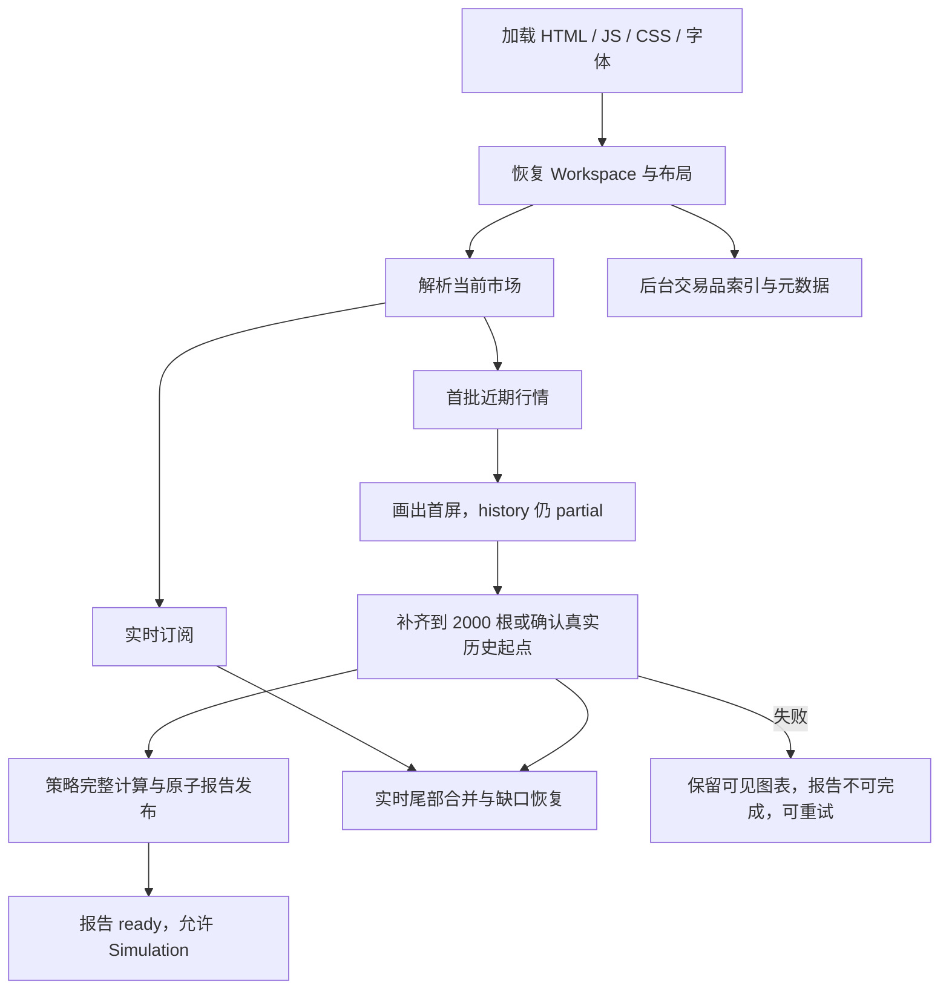

# 首次加载与行情初始化优化计划

日期：2026-10-02，2026-10-07 复核更新。代码基线：当前 `task/p1-priority` 工作树（HEAD `2981cd3` 加未提交改动；本轮未提交改动以本轮验证为准）。

状态：有限性能合同和 REL-06 本地生产两小时范围已完成。默认历史、渐进加载、Worker 懒加载、存储降级、Provider 去重/短 TTL 和主要回归门禁已落地；代表环境下的真实冷/热启动和性能证据以 [STARTUP-01](../backtesting/current/BACKTEST_REQUIREMENTS_STATUS.md) 为准。本文件保留历史实现过程，不替代独立性能报告；跨设备、线上部署和 rollback 仍不在本地证据内。

2026-10-07 已补完整阶段实测：真实 Binance Spot BTCUSDT/15m，恢复 SMA 9/21，冷3页、prime1页、warm3页全部通过，无 routing、行情/Worker 替换或页面错误。每页2,000根连续行情、2,000点曲线、104 closed + 1 open、同run/revision，实际打开 Performance/Simulation。冷/热中位数：首绘787/311ms，完整历史1230/848ms，完整报告1296/927ms，Performance1459/1084ms，Simulation1545/1181ms；warm静态资源传输0且CDP证实缓存。证据 `audit-evidence/2026-10-07-startup-full-report/`；关闭完整阶段计时缺口，不将各3次网络样本当统计p95/SLA。新增报告观察器的4项合同测试拒绝partial、旧身份、缺账本和错误窗口误判。

同日追加原§3渐进预算验收：同一隔离生产产物，受控HTTP每请求300ms/200,000B/s，冷/热各10轮ABBA、四组各20次（80正式+2prime）。冷首绘median/p95为1301/1618→776/950ms，改善40.33%；冷完整历史1396/1721→1291/1666ms，冷完整报告1468/1913→1354/1766ms，热完整报告1402/1588→1302/1509ms。页内暖路径最大median回退1.23%，页面/Worker retained heap最大median增加0.50%，每次2次行情请求，完整OHLCV/交易/统计/曲线/精度SHA一致，82流程零页面/请求错误且销毁归零。`tests/startup_progressive_build.mjs`、`tests/startup_progressive_benchmark.py`可复跑，观察器/预算测试7/7。142项哈希通过；证据 `audit-evidence/2026-10-07-startup-progressive-budget-final/` 保留全部样本和pilot失败。有限渐进预算已关闭。

当前 Final Gate 收敛工作在 `task/p1-priority` 分支推进，细分证据见
[FINAL_GATE_CLOSURE_PLAN.md](FINAL_GATE_CLOSURE_PLAN.md)。固定 BTCUSDT/15m/SMA 数值窗口已验收；
不再把其它数值窗口追加为当前阻塞。Safari 专项、线上部署/CDN/rollback 和 Replay 按用户决定暂缓；
VoiceOver、真实设备触摸和剩余网络/生命周期验收继续单列。下方 2026-10-02 的分支、测试数字和
外部待办均为历史记录，不能覆盖这些新决定。

### 2026-10-02 工作树追加修复（历史记录）

- 启动矩阵新增可选 `--max-p95` 与 `--max-failures` 失败护栏；`verify:startup:full` 现在执行三样本、每个单元首绘 p95 5 秒上限，并纳入离线 smoke、严格性能和视觉/a11y 回归，避免“只绘制成功但性能已回退”仍返回绿色。
- 组合验收已实际复跑通过；随后新增 Binance Futures 30 轮断线/重连/销毁回归、repository-hygiene 和 Vela-PineTS fork 测试门禁，当前根测试为 512/512、Vela-PineTS 为 292/292、release 专项为 27/27、Provider live 为 11/11。类型/构建、Bundle/依赖/repository-hygiene/dist/release、启动矩阵、0 延迟三浏览器竞态、getter/methods/quota 存储故障探针、Provider soak、主流程/Settings/故障隔离/多 Cell、开发/生产/三浏览器 E2E、离线 smoke、strict performance 和 visual/a11y 均通过；外部 Final Gate 仍按下方边界保持开放。
- 追加真实网络短时 soak：`python3 tests/provider_smoke.py --rounds 10` 通过；Binance Spot/Futures 与 Hyperliquid 的历史、symbol-info、live 和 unsubscribe 均完成。该结果增强正常网络证据，但不关闭长时 WebSocket、断网恢复或跨区域稳定性验收。
- 追加兼容性回归：`npm run test:e2e:kill-switch` 和 `npm run test:pinets:offline` 通过（PineTS 1,637 tests、1 skipped）。kill-switch 会留下禁用回测的 dist，因此只作为独立发布前检查，不并入默认组合命令。
- 组合入口补入 localStorage getter/methods/quota 故障探针；三种模式各 1 次首绘成功（约 1.04s / 0.99s / 0.99s），架构脚本 18/18 通过。

- 持久化 Workspace 的 `bars` 在迁移边界统一规范为正整数：小数历史预算向下取整，低于默认值的值提升到 2000；不触碰 `rendererConfig.bars` 等同名绘图对象。
- `request.security` secondary feed 在 Provider 返回超出请求范围或超出数量时，重新执行时间边界过滤和 newest-tail limit，避免过量行情污染低周期回测。
- secondary feed 现在在直接 Worker/in-process 路径也拒绝非有限日期、反向区间和 `limit <= 0`，与应用 Provider range 合同保持一致；新增回归覆盖宽松第三方 fetcher 不得绕过该门禁。
- Provider live 生命周期新增 30 轮 subscribe/unsubscribe soak，以及 Binance Futures/Hyperliquid 各自 30 轮连续断开/重连后销毁回归，确认 socket 关闭、wrapper 恢复、重复 unsubscribe 幂等且不会泄漏重连定时器；这些测试是本地重复生命周期门禁，不替代真实长时网络故障验收。
- Provider metadata TTL/并发去重现在按调用方返回独立克隆，避免可变嵌套 `symbols`/`filters` 污染缓存快照；新增嵌套 mutation 回归，未改变单请求去重和 TTL 语义。
- `ensure-fork-build` 增加跨进程 lock：并行 `npm test`/`npm run build` 时只有一个进程重建 fork 产物，等待者复用已完成输出；真实双进程并发验证通过，锁目录位于被忽略的 `.cache/`。
- Provider 历史守卫进一步 fail-closed：未经过网络 transport 守卫的自定义 Provider 返回非数组或全为 malformed OHLC 行时也发布明确错误，不再被归一为成功的空行情；新增根级 R11 回归，当前根测试为 512/512。
- 主 `npm run build` 的 `prebuild` 和公共 `npm run build:forks` 均切换到同一 `ensure-fork-build` 入口，实际 fork 编译下沉到内部 `build:forks:run`，所有常用入口都经过跨进程锁；架构回归固定该契约。
- 新增安全的 `npm run dev:fast`：只校验 fork 完成清单、输入/输出指纹和 toolchain，不在日常开发启动时重复构建；发现缺失或过期会失败并要求先执行 `npm run build:forks`，不会静默使用旧产物。普通 `npm run dev` 仍保留完整 predev 自动修复路径。
- `dev:fast` 改用 `scripts/dev-fast.mjs` 统一消费 `--check-only`：`npm run dev:fast -- --check-only` 现在只执行 fork 产物校验，不会把未知参数转发给 Vite；正常启动参数仍原样传递给 Vite，并已用临时端口验证。
- 新增 `npm run verify:startup`，串行执行根测试、类型检查、生产构建、Bundle/依赖/dist 门禁、release 门禁及 fork 产物只读校验；真实 Provider smoke、浏览器 E2E 和长时网络验收继续单独执行，不伪装成该本地汇总命令的一部分。
- 新增 `npm run verify:startup:full`，在本地门禁基础上串联三轮真实 Provider soak、开发/生产 E2E 和 Chromium/Firefox/WebKit 回归；它是完整本地验收入口，仍不代表线上长时故障、跨机器 p95 或真实 rollback 已完成。
- 生产预览启动矩阵已用 `--preview --samples 1 --index-delay 0 --bar-delay 0` 完成 4/4 无失败；该小样本只验证 preview 探针链路，不替代正式生产 p95 基线。
- Provider smoke 增加显式 `npm run test:providers:soak` 三轮入口；每轮重新创建 Binance Spot/Futures 与 Hyperliquid provider，并验证历史、symbol-info、live 首帧和 unsubscribe。它补充真实短时生命周期证据，不关闭长时 WebSocket/断网恢复门禁。
- fork 构建缓存改为输入/输出 SHA-256 完成清单，并额外检查 `packages/pinets/dist/types/index.d.ts`；失败或中断会留下 incomplete marker，下一次必须完整重建，不能复用部分产物。
- 完成清单同时记录 Node/platform/arch/npm toolchain fingerprint；跨运行环境不会盲目复用旧 fork 产物。
- 新增内容不变 mtime 回归：输入文件内容被修改但时间戳恢复时，缓存仍会因 SHA-256 变化而重建。
- stale-lock 回收增加独立 reclaim mutex，并在取得回收权后重新读取 owner/年龄，避免多个等待者把新锁误回收。
- fork 构建锁释放改为 token 校验后的原子 rename，再次校验搬移目录所有者；即使 stale reclaim 在释放窗口替换同名锁，旧 owner 也不会删除新 owner 的锁，并新增受控竞态回归。
- fork 构建锁在 owner.json 初始化失败时现在清理刚 claim 的目录，避免留下无 owner 的锁让后续构建无限等待；新增失败注入回归。
- Provider metadata 在 `structuredClone` 和 JSON 深拷贝均不可用时 fail-closed，不把不可安全隔离的对象放入 TTL 缓存；progressive history abort 即使已有完整前缀也返回明确错误，避免被误判为成功完成。
- Provider metadata 即使将 settled TTL 设为 `0`，并发调用仍按调用方返回独立快照；关闭 TTL 只关闭已完成结果缓存，不关闭 transport 去重或可变对象隔离。
- Provider 网络层现在对所有 JSON 响应（包括不可缓存的历史 K 线数组）按调用方返回独立深拷贝；并发去重只共享 transport，不共享可变 payload。
- 新增 `npm run test:startup:matrix`，按 ABBA 顺序隔离运行 20×4 个 Chromium dev 样本；2026-10-02 最新受控 2s 索引延迟结果为裸 `BTCUSDT` median-of-medians `2677ms`、显式 `binance:BTCUSDT` `738ms`，baseline/optimized p95 上界分别 `2885ms/1039ms`，所有 80 个样本无页面错误。该结果证明受控路由收益，不替代跨机器、真实网络和长时 Provider p95。
- Provider smoke 扩展为真实网络同时验证 Binance spot `BTCUSDT`/15m、Binance USDT 永续 `BTCUSDT.P`/1h 的历史与 symbol-info 类型，以及 Hyperliquid `BTC`/15m 历史和 live；本轮结果三条路由均成功，长时断网与重连仍未因此关闭。
- Binance 45m/180m 聚合新增确定性 golden：分别只请求 15m/1h 原生数据，检查 3 倍分桶、OHLC、newest-tail limit 和源请求 limit，避免聚合边界只靠实时 smoke 推断。
- Pine Editor 的 CodeMirror 依赖改为首次打开侧栏时动态加载，主入口不再静态引入编辑器；生产主 chunk 从约 2.28MB/648KB gzip 降至约 1.77MB/477KB gzip，编辑器独立为约 508KB/170KB gzip chunk，并保留加载中、迟到操作重放和销毁门控。
- 复核并修复 Pine Editor 侧栏“已挂载但未打开”仍提前触发动态 import 的问题：后台 `log/reportError/detach` 事件只排队，不加载 CodeMirror；仅侧栏真正可见或用户明确打开/新建/打开脚本时加载。全新页面资源探针确认首屏不请求 editor chunk，主 E2E 通过。
- 主开发 E2E 现在明确断言 Pine Editor chunk 首屏未加载、真实打开侧栏后才出现；生产 E2E 也通过同一编辑器工作流，防止只看构建产物而遗漏动态加载失败。
- 开发 E2E 的 Trades Log 表头断言改为等待完整 sortable header 快照，避免实时报告替换造成“旧表头文本 + 新表头按钮”交叉读取的时序误报；本次复跑通过。
- 修复 aborted-history Retry 在 Vela market 未携带 `bars` 时退回 500 根的问题：观察器和适配器现在统一使用 Workspace 的 2000 根默认深度，并新增行为回归。
- 根目录新增 `npm run typecheck`，串行检查根应用和 `packages/vela-pinets`，使计划中的类型门禁可直接执行。
- 清理 `ensure-fork-build` 中已失效的 mtime/stale 判断，完成状态统一由输入/输出 fingerprint 和 manifest 决定。
- toolchain fingerprint 不再混入仅由 npm 调用方式注入的 `npm_config_user_agent`，避免直接执行脚本与 `npm run` 之间产生无意义的重复 fork 构建；Node/platform/arch 及输入内容仍参与缓存隔离。
- 追加验证：Settings、故障隔离、多 Cell、strict performance、visual/a11y、开发/生产 E2E、三浏览器、Provider smoke 均通过；现有 5190 端口为外部保留进程，未被本轮测试占用或停止。
- 生产离线 smoke 通过：页面 HTTP 200、无页面错误、无 LuxAlgo 外部资源请求；24 次 Provider 请求按离线策略被阻断并被正确记录，不能将其误报为真实 Provider 成功。
- 本轮验证（历史批次）：根测试 505/505、Vela-PineTS 292/292、fork lock/recovery 12/12、Provider network/progressive/live 73/73、release artifacts 11/11（组合 release 门禁 23/23）、统一 HTTP 就绪探测、根/Vela 类型检查、生产构建、bundle budget、依赖契约、dist 独立性和 `git diff --check` 均通过；新增 `dev:fast --check-only` 只读缓存校验及活动构建竞态回归通过。当前数字以最新复核为准。
- 新增 `npm run test:release`，统一执行 fork-build lock/recovery、release manifest、Storage schema reconciliation 和 candidate/previous 同槽位 rollback 回归；当前 27/27 通过，并新增 manifest/verifier 对 `dist`、发布根目录、锁文件及 fork 构建输入符号链接和 manifest 类型的 fail-closed 校验。

### 2026-10-02 本轮实现进展

- 为渐进历史分页增加无进度保护：Provider 返回非空但全部越过请求边界、重复页或探测结果不可用时，不再把它误判为 genesis；保留已绘制前缀并发布明确错误，避免启动加载无限重试或开放不完整 Simulation。新增回归覆盖，根测试 469/469、Vela-PineTS 289/289。
- lower-timeframe session cache 现在只保留完整、有限数值的 OHLCV 数组；混合 malformed 行不会污染 TTL，后续 retry 可重新获取有效精度数据。
- 历史观察器保留本代 `history:complete` 边界；Provider/progressive Promise 晚于 Vela 完成事件结算时会重新核对，迟到错误会撤销假 genesis/no-data。

- 渐进历史遇到短页时增加可取消的单根历史探测：只有探测确认无更早数据才宣布 genesis；若探测到更早数据则继续分页，探测失败保留已绘制前缀但发布错误事实，避免短页造成静默缺历史。
- 统一 `metadataCacheTtlMs <= 0` 对 REST 元数据和 symbol index 的禁用语义；模板仓储拒绝无法作为 Workspace document 应用的 null/数组/原语状态，并增加对应回归测试。
- 为 `packages/pinets` 增加显式 `test:offline` / `test:network`（根目录分别为 `npm run test:pinets:offline` / `npm run test:pinets:network`）入口；离线套件 1,637 tests 通过。原有 `test` 保留上游完整联网语义，不用空响应掩盖网络故障。

- 修复 Binance spot 异步解析 WebSocket 地址时的 unsubscribe 竞态：`spotWsBase()` 尚未完成时不提前恢复构造器 guard，Promise settle 后再让出一个 task 覆盖 `await` 后的迟到 `new WebSocket()`。
- 覆盖 Hyperliquid 重连、迟到 `onopen`、多订阅嵌套释放顺序及重复 unsubscribe；Provider 生命周期专项 7/7，通过 TypeScript、根测试 468/468。
- 本修复只位于集成层和测试层，未修改 `node_modules` 或 Vela 产物；长时真实网络故障、断网恢复和部署平台 rollback 仍保持开放，不能因专项通过而关闭 S5。
- 修复 symbol index 在“缓存过期→故障 fallback→恢复”后再次故障时无法重新开启恢复周期的问题；对 malformed/缺失 ticker 的索引项拒绝、清理 ticker 外层空白并回退到安全默认目录。
- 修复点位历史恢复的周期解析：严格区分 Pine/Vela 的月份 `M` 与分钟 `m`，并覆盖长英文周期拼写；同时将 Workspace 历史深度迁移的非法预算和非字符串存储值挡在持久化边界外。
- 修复 Bar Magnifier lower-feed 对超大/非安全周期值的范围与 limit 计算：不再构造不安全请求，统一降级为未知周期；补充运行时回归。
- 为 `request.security` secondary feed 增加 resolved malformed OHLC 防护，同时保留 rejected Provider error metadata 向 Session error 传播；补充回归，并隔离坏 getter/非法 volume 行、重复和乱序时间戳。
- 本轮新增 Provider/Storage/Bar Magnifier 回归后根测试为 470/470，Vela-PineTS 为 289/289；TypeScript、构建、启动探针、依赖契约、dist 独立性和 bundle budget 均通过。

### 本轮晚到历史错误复核

普通 Provider 与 progressive Provider 的 late-failure 回归已通过；根测试当前为 472/472，Vela-PineTS 为 290/290。

零延迟边界补测：`startup_loading.py --index-delay 0 --bar-delay 0 --samples 5` 全部通过，首绘样本均完成且无页面错误；该结果补充了此前极短延迟时序不稳定的证据，但不替代真实网络长时 p95。

## 1. 目标与边界

在保留默认 2000 根历史、既有 Workspace 行为和回测真实性的前提下，缩短首次图表可见时间、降低无关网络等待与首屏资源成本。

- 新旧用户均不需要清理缓存；保留品种、周期、布局、绘图、自建脚本、收藏、指标参数及模板。
- 首屏可见不等于回测完成；历史未完整时可以保留进度和部分图表，但不得发布最终指标/账本/曲线能力或开放 Simulation。
- 同一确定数据集下，优化前后 OHLCV、指标、逐笔交易、权益曲线和 KPI 必须一致。
- 优化针对浏览器加载，不能把开发服务启动的 fork 构建耗时混入页面性能。
- 不改变交易撮合语义，不借本任务实施 Replay、策略算法或整套 UI 重设计。
- 不修改 `node_modules`；优先应用集成层公共 API。需要新增 Vela fork 时先记录必要性、成本与验证结果，不能偷偷补丁依赖产物。
- 本轮交付为新分支和可执行方案。执行阶段依照下列任务自主排障、复测；无权限新增的外部基础设施不作为默认前提。

## 2. 已核验事实与先前说明的修正

| 事实 | 源码依据 | 对设计的影响 |
| --- | --- | --- |
| 默认 BTCUSDT / 15m / 2000 根，开启实时 | `src/config/workspace-options.ts` | 优化不减小最终历史深度 |
| 旧 Workspace 读取时迁移深度 | `src/integrations/storage/workspace-storage.ts` | 保护原配置并补充存储异常测试 |
| 当前同时注册 Binance、Hyperliquid，默认裸 ticker 需解析 | `src/integrations/vela/create-workspace.ts`、`provider-registry.ts` | 验证显式路由能否绕开索引等待，不删除 Provider |
| Binance 原生周期 2000 根通常两次串行分页 | Vela 0.7.7 `providers/binance.js` 的 `fetchKlines/paginateBackward` | 请求量与延迟分别测量；不能宣称翻四倍 |
| 45m/180m 会获取低周期后聚合 | 同上 `getBars/selectSubTf` | 2000 目标可能请求 6003 根底层数据；必须测试聚合边界 |
| 可用历史不足会提前终止 | 同上分页逻辑 | 周/月周期不可能保证取得几十年、几百年不存在的行情 |
| Vela 优先尝试渐进接口，Provider 未实现时返回 null 走普通加载 | Vela `ProviderFeed.loadProgressive`、`EngineOrchestrator.loadMarketInner` | 可以从公共 `getBarsProgressive` 能力着手；2000 根并非自动先画 300 根 |
| 深历史普通路径阈值为 >5000；有 loadRange 时先取最多 10000 根 | 同上 `SINGLE_LOAD_BARS/CHUNK_BARS/PREVIEW_BARS` | 不能把 PREVIEW_BARS=300 当作所有路径的首屏策略 |
| 渐进 Provider 抛错会被 ProviderFeed 转成空数组 | 同上 `loadProgressive` catch | 新能力会触及历史完成/错误语义，必须先做故障原型，不能直接上线 |
| 已有共享内存 BarStore、覆盖检查、缺口/尾部补取 | Vela `CachedDataFeed`、`ProviderRegistryFeed` | 不再建立重复且无边界的行情缓存 |
| Highcharts 和 highcharts-more 已动态导入 | `src/features/backtesting/highcharts-renderer.ts` | 不把已有拆包列为新收益；调查何时实际触发加载 |
| 引擎实例按 Cell 管理，Workspace 销毁时 terminate | `src/integrations/pinets/create-engine.ts` | 不跨已销毁 Workspace 留 Worker；复用要遵守现有生命周期 |
| PineWorkerEngine 构造只保存 spawn，实际 Worker 在需要时懒创建 | `packages/vela-pinets/src/pinets-worker/PineWorkerEngine.ts` | 不把“提前启动所有 Worker”当作现有瓶颈；测实际 prepare/execute 成本 |
| predev 已有 fork 产物缓存检查；dev:fast 只做严格校验 | `scripts/ensure-fork-build.mjs`、`package.json` | 普通入口保证 fresh checkout 可启动，快速入口拒绝过期产物 |

上述为源码事实，真实耗时、关键路径比例和跨设备收益仍需测量。不能把 HTTP 200 或现有测试数当作浏览器功能证明。

## 3. 测量与目标链路



这是优化目标图，不是当前精确事件时序。实时订阅可能与补历史重叠，必须处理快照覆盖实时尾部的问题。`visibleRange`、离线数据、热缓存及多 Cell 单独保留原生路径。

### 3.1 观测指标

以 navigation start 为统一原点；增加仅开发/诊断模式启用的计时器，不输出脚本源码、账户、持久化内容。

| 指标 | 采集点/证据 |
| --- | --- |
| 首次界面可操作 | Workspace 挂载后真实按钮点击成功 |
| 首根行情可见 | Canvas 实际有数据 + chart 数据数，不用 `load:end` 单独代替 |
| 全历史完成 | reason-bearing history 事件 + 数量/边界/请求成功证据 |
| 首次完整报告 | ledgerRevision/runToken 对齐，账本、曲线、KPI 可复算 |
| 网络成本 | 每个 venue/endpoint 请求数、字节、首尾响应、重试、取消 |
| 主线程/内存 | 长任务、脚本解析、渲染、Worker 数和销毁后资源回收 |
| 下载成本 | production 首屏实际请求的 JS/CSS/字体 gzip 总量，而非只看单个 chunk |

基线与优化版在同机同浏览器按 ABBA 顺序各至少 20 次；分别记录冷 HTTP 缓存、热 HTTP 缓存、新页面、页内暖数据缓存；原始样本和异常样本均留存，不任意剔除失败。

受控网络场景固定每请求延迟、带宽和确定 OHLCV，记录 median/p95；真实 Binance/Hyperliquid 单独报告，不将网络抖动归因于代码。慢网、断网不是伪造数据后宣布通过。

初始验收预算（须在实现前用基线验证可测性，不能事后为过测放宽）：

- 渐进方案冷 2000 根首屏 median 改善至少 20%，p95 不回退；否则继续调批大小或不启用该策略。
- 全历史/完整报告 median、p95 相对回退不超过 10%；不得靠首屏变快掩盖最终计算显著变慢。
- 常规原生 Binance 冷 2000 根行情请求上限从 2 次增至最多 3 次（若选择 500+1000+500）；无重复全量补取。
- 热路径耗时及内存相对基线回退不超过 10%；单元/确定性结果零差异。
- 资源拆分目标为 production 首屏实际 JS gzip 至少下降 15%；若无收益则不合入仅移动 chunk 名称的改动。
- 性能门禁区分网络失败率、渲染失败率及结果不完整率；任何账本错误为硬失败，不允许性能指标抵消。

## 4. 实施任务与依赖

### P0 / S0：基线与前置可靠性

1. 新增 `tests/startup_loading.py`（根命令 `npm run test:startup`），对真实 App 执行网络时间线、首屏和最终报告观测；支持 dev/preview、三浏览器、独立临时端口和 profile。
   另有 `npm run test:startup:matrix` 以显式 `binance:BTCUSDT` 与裸 `BTCUSDT` 受控对照，按 ABBA 顺序运行隔离 profile，并输出每组 median/p95；它是性能证据工具，不把受控索引延迟冒充真实交易所网络结果。
2. 新增存储边界测试：读取 `window.localStorage` getter 抛错、get/set/remove 抛错、quota、坏 JSON、多 Cell、缺省/500/2000/>2000、绘图中的同名 bars 字段。
3. 修复当前存储适配器创建时可能因 SecurityError 阻断 Workspace；存储不可用则会话内继续，禁止清空其他用户数据。将默认深度与迁移阈值统一来源，并明确现行“至少 2000”策略。
4. 对真实 Vela 恢复路径验证迁移生效，而非只对 JSON 函数做断言。
5. 固化源码/锁文件/构建版本、完整数据与基线报告散列；数据和性能附件仅存 `audit-evidence/startup-loading/`（已忽略）。

交付：可复跑基线、存储故障防护、观测脚本。S0 通过后再修改加载路径。

### P1 / S1：市场路由与索引解耦

修改候选：`create-workspace.ts`、`provider-registry.ts`；必要时新增独立路由模块。

- 已完成受控浏览器验证：默认 `binance:BTCUSDT` 在 2s 索引延迟时比裸 `BTCUSDT` 首绘提前约 1.07s；本地多 Provider 搜索池、venue 所属、显式路由、模板有效/损坏恢复已覆盖，真实交易所长期索引恢复仍开放。
- 不把所有 BTCUSDT 强行迁移为 Binance：已显式指定的 venue 和未知裸 ticker 保持原行为。
- 索引仍注册且可恢复；保留 30 秒 fallback、onIndexRecovered、online 重试。先解除阻塞，不为减少请求删除交易品选择器能力。
- 若索引后台并发不阻塞，不做无收益的“延迟所有索引”；仅在测量表明确有竞争时通过公共注册机制延迟非当前 Provider。
- 元数据影响 syminfo/mintick，不能用假精度抢先启动策略后静默改结果。

验收：阻断非当前 venue 索引时当前 BTCUSDT 能显示；品种搜索最终完整、恢复正确；Spot/Futures/Hyperliquid 均能切换。

### P1 / S2：渐进行情原型 → 安全启用

修改候选：新增 `src/integrations/vela/provider-progressive.ts`，接入 `provider-registry.ts`，复用 `provider-history.ts`、`provider-network.ts`、`workspace-history-observer.ts` 的错误事实链。

1. 先以真实 Vela + 可控 Provider 证明首屏、回调、异常、取消、history 完成的实际契约。重点证明 ProviderFeed 吞错后适配器仍禁止 ready；无法证明时不得开启生产路径。
2. Binance 原生周期：优先原型为 1000+1000（两请求、第一页即可显示），并对比 500+1000+500（三请求）。Vela FIRST_PAINT_BARS 为20，无需修改首画阈值；以首屏和完整报告双指标选择，不把“500”写死成不可讨论要求。
3. 历史分页严格用最早 open time - 1 作为上界；回调提供累计、递增、去重后的快照，末页不足时核验真实 genesis，错误不能作为 genesis。
4. 45m/180m：先按目标周期分桶设计窗口，再处理首尾非完整聚合；最终数据与旧整批算法逐字段相等后才启用。否则该周期继续走原路径并记录范围。
5. Hyperliquid 单次窗口已能获取 2000 根；只有测量证明拆成两次更优才渐进化，不能机械增加 REST 开销。
6. 尊重 AbortSignal；取消订阅者不能取消其他 Cell 共用请求。底层暂不可真正 abort 时至少阻断后续分页与迟到发布，并明确剩余请求成本。
7. 首批期间保持 history backfill；策略全历史计算只在最终完成后执行，不先做一次昂贵的 500 根策略再重复跑 2000 根。
8. 保留最后实时尾部；不允许旧历史覆盖更晚 websocket bar。正在形成的 K 线单独处理。
9. `visibleRange`、offline、warm-cache、向左拖动、>5000 深历史均测试；不通过重复 `setMarket(500)` → `setMarket(2000)` 模拟补齐。

回退：独立开关关闭渐进层后回到现有 Provider.getBars 和 Vela 生命周期；不能关闭错误门控“救活”报告。如果公共接口无法正确表达完成/失败，记录最小 Vela fork 需求并隔离实施；不要悬置任务或谎报成功。

### P2 / S3：请求去重（以测量发现为准）

- 先查 Vela 暖缓存、symbol index Promise 复用已有覆盖；仅对实际重复 in-flight 请求增加有界去重。
- key 至少包含 provider、真实 endpoint、ticker、timeframe、session、from/to、limit 和返回形态；失败移除、finally 释放、数量上限。
- 每个 Cell 保留独立请求/错误身份，跨 Cell 不串 history 事实。取消一个 consumer 不影响其他 consumer。
- 暂不引入持久化行情数据库；元数据短 TTL 缓存需明确 schema、venue、过期恢复、禁用存储降级和变更刷新，只有确有收益才纳入实现。

### P2 / S4：首屏资源和计算开销

- 以 production waterfall 确认 Highcharts 是否被隐藏面板提前触发，优先延迟实际 mount，而不是重复拆包。
- 检查 `create-app.ts` 静态导入的编辑器/回测模块和 `src/scripts/library/index.ts` 全量 raw 脚本；选择收益最大的独立功能边界懒加载。
- 异步 feature mount 必须支持 loading/error/retry、早到事件、destroy 后不挂载；保留原有同步宿主 API 或提供兼容入口。
- 引擎 factory 当前为同步契约，不能直接返回 Promise；若延迟 Worker 资源需在 prepare 边界或明确加载前置层实现，保持每 Cell 隔离。
- 不跨 workspace 销毁复用 Worker；不假定可以把“最近 500 根状态”向更早历史续算。一般 Pine 回溯补历史须重算完整时间序列。
- 不按显示 tab 改变核心账本/KPI语义；可延迟纯展示性 Analysis/Simulation 图表计算。

### P3 / S5：整合与交付

- 各阶段单独提交，问题先复现→修复→新增防回归→复跑，不修改断言来掩盖非预期。
- 组合开启优化与全部关闭优化分别测试；开关仅影响性能路径，不改变数据正确性标准。
- 构建后执行真实生产页面 smoke、离线静态资源检查、完整功能回归；不能以 dev 通过代替生产包。
- 创建带 commit 的 release manifest，使用 `release:verify --help` 确认参数后验证；模拟旧/新制品切换和浏览器缓存恢复，保留相同 Workspace 和脚本。
- 最终启动单一人工验收服务并报告地址/commit；只清理本轮拥有的进程，不停止用户其他服务。

## 5. 测试矩阵与硬性不变量

| 层级 | 必测场景 | 通过依据 |
| --- | --- | --- |
| 单元 | 分页边界、去重排序、空页/不足页、聚合、超时/429/503/非法响应、Abort、存储异常 | 完整 OHLCV 字段、错误身份、回调顺序断言 |
| 真实引擎集成 | PineEngine + PineWorkerEngine；同数据优化开/关 | 所有交易 entry/exit/size/P&L/MFE/MAE、曲线和 KPI 机器比较；不只比净利润 |
| 生命周期 | 快切市场/周期、hide/show、迟到响应、多 Cell、历史完成后加策略、destroy、Retry | 无旧 run/revision/epoch 覆盖，无 partial→假 ready |
| 行情网络 | 原生 1m/15m/1h/1D；聚合45m/180m；Spot/Futures/Hyperliquid；forming bar | 请求量/边界正确，最终数据一致，真实网络证据独立记录 |
| 错误恢复 | 首批成功后失败、索引失败、WS无数据/重连、断网恢复、metadata失败 | 图表可保留，结果标明未完成且禁用 Simulation；Retry 可恢复 |
| 主界面回归 | 工具栏、品种、周期、时区、布局、指标 on-chart/收藏/个人/内置、源码、脚本保存、模板、截图、编辑器、绘图 | 实际鼠标和键盘操作，不只检查 DOM 存在 |
| 回测 UI | Dock、Viewer 四 Tab、Settings 合并提交/焦点、Simulation、交易定位 | 原流程和可访问性不退化 |
| 状态恢复 | 全新页面、旧 Workspace、多个窗口、模板恢复、热/冷缓存 | 无数据丢失、深度正确、存储失败不阻塞启动 |
| 浏览器 | Chromium/Firefox/WebKit，桌面/窄屏；dev+preview | 新增真实主 App 场景；已有跨浏览器 fixture 不等于完整主 App 验收 |
| 资源与发布 | 重复挂载销毁、30次切换、长任务、实际下载量、旧制品回滚 | 无持续增长的监听器/Worker/请求，版本明确，资产一致 |

关键不变量：报告必须同 market + run + revision；历史失败不允许模拟；完整历史与正在形成的 bar 区分；无数据与接口失败区分；多 Cell 独立；计算结果不因首屏批次大小改变。

已有命令继续执行（先读脚本参数和前置条件，测试/构建顺序运行，不竞争资源）：

```sh
npm test
npm run typecheck
npm run test:regression:existing
npm run test:forks
npm run test:forks:offline
npm run build
npm run check:dependencies
npm run check:dist:independence
npm run check:bundle-size
npm run test:e2e
npm run test:e2e:settings
npm run test:e2e:fault-isolation
npm run test:e2e:multicell
npm run test:e2e:cross-browser
npm run test:e2e:prod
npm run test:e2e:performance
npm run test:providers
npm run test:visual:a11y
npm run test:e2e:offline
npm run test:e2e:kill-switch
git diff --check
```

kill-switch 测试后重新进行普通 production build，避免遗留禁用回测的 dist。新增启动测试必须运行实际 App；受控行情用于确定性和故障时序，真实网络 smoke 用于证明真实接入，两者不可互相替代。外部网络失败记录为未验证，不算 PASS；重复失败先诊断 endpoint/网络再重试。

`test:forks` 保留上游完整联网语义；本地和 CI 的无网络门禁使用 `test:forks:offline`，避免把 Binance/DNS 故障误报为 fork 回归。

## 6. 自动推进与完成标准

执行顺序：S0 → S1 → S2 → S3/S4 → S5。S3/S4 可并行研究，但共享生命周期改动必须整合后重新验证。

| 任务 | 当前状态 | 完成证据 |
| --- | --- | --- |
| 新分支、基于代码的计划 | 已完成 | 分支与本文件 |
| S0 基线、观测和可靠性 | 部分完成 | `npm run test:startup`；三浏览器多样本、显式/裸路由、2s/0s 索引延迟、存储 getter/methods/quota 故障均有证据；跨机器长期 p95 和真实网络长时样本仍开放 |
| S1 路由和索引 | 部分完成 | 默认 Binance 显式路由，受控首绘提前约 1.07s；多 Provider 搜索/显式路由/模板恢复本地回归通过；真实交易所长期索引恢复仍开放 |
| S2 渐进加载 | 部分完成 | Binance 原生 2000 根 progressive 模块、短页 genesis 探测、错误/取消/分页单测及真实 App 2×1000 请求；长历史真实网络、低周期聚合和逐笔等价的完整证据仍开放 |
| S3 去重 | 已完成（有界缓存 + live 生命周期） | `provider-network.ts` 对 Binance JSON 和 Hyperliquid POST 做 provider-instance 级并发去重，并对所有 JSON payload 按调用方隔离；exchange metadata 使用可配置短 TTL；`provider-registry.ts` 对 symbol index 使用同一实例隔离 TTL；`provider-live.ts` 覆盖 async spot endpoint、重连和嵌套订阅释放。失败自动释放并可重试，当前 Provider network/progressive/live 重点回归 73 项通过；受控启动中 Binance `exchangeInfo` 从 4 次降至 2 次，历史 K 线请求仍保持 2 次 |
| S4 资源延迟加载 | 本地门禁完成，长期观测仍开放 | Pine Worker 与 Pine Editor/CodeMirror 均按需拆 chunk；主 JS 约 3.71MB 降至 1.77MB/477KB gzip，编辑器 chunk 约 508KB/170KB gzip，Worker 约 827KB/207KB gzip；`npm run check:bundle-size` 已收紧到当前产物上方约 10% 的 main/worker/highcharts raw/gzip budgets；跨浏览器、性能门禁和视觉/a11y 门禁通过，长时资源观测仍开放 |
| S5 组合回归/回滚/人工入口 | 部分完成 | 当前工作树根测试 512/512、fork lock/recovery 15/15、Provider live 11/11 + Binance/Hyperliquid 各 30 轮重复断开/重连后销毁、Vela-PineTS 292/292、PineTS 离线 1,637 tests、统一 HTTP 就绪探测、开发/生产 E2E、Settings、故障隔离、多 Cell、跨浏览器、性能和视觉/a11y 均通过；`verify:startup:deploy` 已串联本地门禁与 10 轮真实 Provider soak；仍需人工线上入口、长时 Provider/断网恢复、真实制品 rollback 验收 |

发现问题自主处理，不因一个失败路径停下；仍保留待办直到证据关闭。不可用“413/414 等历史测试数量”推断完成。性能无收益则自动调整方案或撤回该项代码，保留测量结论；业务回归必须修复后再前进。

当前已通过：根测试 512/512、fork lock/recovery 15/15、Provider network/progressive/live 目标回归、Vela-PineTS 292/292、PineTS 离线 1,637 tests、TypeScript、构建、依赖契约、dist 独立性、统一 HTTP 就绪探测、主开发/生产 E2E、Settings、故障隔离、多 Cell、三浏览器 fixture、性能 strict、视觉/a11y 和 Provider smoke；`dev:fast --check-only` 已验证过期产物及活动 fork 构建会拒绝启动，正常临时端口启动也已验证，Pine Editor 首屏资源探针和指标管理器首次点击加载也已验证。PineTS 的 `test:network` 仍是显式联网覆盖；本轮因 Binance/DNS/代理连接超时主动停止，记录为外部未验证，不替代离线门禁。

2026-10-02 最新组合复核：开发/生产 E2E、Settings、故障隔离、多 Cell、Chromium/Firefox/WebKit、性能 strict、视觉/a11y、Provider smoke 及零延迟启动 5/5 均通过。历史观察器 late-failure、lower-feed malformed cache 和 progressive non-progress 防护均已提交；S0/S1/S2/S5 的长期真实网络、跨机器 p95、线上 rollback 仍保持开放。

2026-10-02 当前正常 production 构建启动采样：Chromium 5 次首绘 `637/644/665/743/994ms`（median `665ms`），Firefox 3 次 `687/738/1790ms`（median `738ms`），WebKit 3 次 `705/801/958ms`（median `801ms`），全部无失败。样本仅证明当前机器/受控延迟下的可重复性，不关闭跨机器长期 p95。

2026-10-02 编辑器延迟加载复核：开发/生产主 E2E 和 Chromium/Firefox/WebKit fixture 均确认首屏不请求 Pine Editor chunk，打开侧栏后才加载；脚本新建、保存、运行、销毁和跨浏览器回测结果均未回退。当前生产主 chunk 约 `1,768KB raw / 477KB gzip`，编辑器 chunk 约 `508KB raw / 170KB gzip`。

2026-10-02 显式路由对照：在同一 Chromium、同一 2 秒 symbol-index 延迟和同一行情响应下，`binance:BTCUSDT` 首次蜡烛绘制约 `1.07s`，裸 `BTCUSDT` 约 `3.15s`；显式 provider 路由确实绕过了交易品索引等待，裸 ticker 仍需等待索引/回退逻辑。该结果是受控单样本证据，不替代跨机器 p95。

发布脚本复核：`release-manifest --help` 现在返回明确用法而不生成 manifest；release-artifacts 回归 9/9，现有旧制品验证和 slot rollback 模拟仍通过。

2026-10-02 追加验证：根测试 445/445；Vela-PineTS 283/283；Binance/Hyperliquid provider smoke 均取得 5 根历史并启用 live；Chromium/Firefox/WebKit 启动首绘约 282/503/439ms（受控 150ms 索引、80ms K 线延迟），首批 1000 根随后完成 2000 根；开发/生产 E2E、Settings、故障隔离、多 Cell、性能 strict、视觉/a11y、离线 smoke 均通过。离线 smoke 的外部 Provider 请求按测试策略被阻断，不能替代真实 Provider 长时故障验收；生产构建仍有约 2.27MB 主 chunk / 825KB Worker chunk 的非阻断 warning。

2026-10-02 本轮代码复核：D-01 历史完成后立即挂载、晚挂载、延迟适配器及两种真实引擎均通过；Provider live 7/7（含异步 Binance endpoint、Hyperliquid reconnect、嵌套订阅）；根测试 454/454、Provider 专项 52/52、Vela-PineTS 283/283、开发/生产 E2E、三浏览器、性能 strict、视觉/a11y、Provider smoke 均通过。`startup_loading.py` 在默认延迟、2 秒索引延迟和 0 秒索引/行情延迟场景均通过；此前 `bar-delay=80ms` 的偶发超时已用 0 秒场景 11/11 复测收口，不将单次旧时序抖动继续作为当前未决缺陷。

2026-10-02 冷/热启动补测：Chromium 3 次首绘 `620.8/518.8/528.5ms`（median `528.5ms`），Firefox 2 次 `733/550ms`（median `641.5ms`），WebKit 2 次 `634/626ms`（median `630ms`）；getter 和 Storage methods 故障各 1 次均成功启动。该样本证明当前跨浏览器和存储降级链路可工作，但样本量仍不足以关闭完整 S0 冷/热 p95 门禁。

2026-10-07 启动测量纠正：首版 `--real-provider` 虽然不注入行情，但仍注册 `context.route('**/*')`，Playwright 因而禁用 HTTP cache；共享 context 每轮还重复安装了观测脚本。旧 `1369.8/614.3/674.8ms` 只能说明同 context 新页面能首绘，撤回其“HTTP 热缓存”结论；旧 `948.7/847.6ms` 也不能作为未拦截请求的基线。旧附件仅留作追溯，不与更正后的样本合并计算。

更正后的真实模式完全不注册 Playwright routing，通过 request/response/requestfinished 事件观测实际网络；初始化脚本在 context 创建时仅安装一次，真实开发模式也不再通过 main.ts 改写取得 App 引用。`--hot` 必须同时指定 `--real-provider --preview` 且至少两个样本：序号 0 是 prime，其后才是 warm；若 warm 页面没有同源生产 JS/CSS 的缓存命中证据，运行失败。冷模式每次创建无 HTTP 缓存的新 context，服务器在样本之间复用；“冷”不表示清空操作系统 DNS、代理或服务器缓存。每次页面均恢复相同的 Workspace 种子，行情内存缓存不跨页面共享。

更正后的生产基线：本机 `HeadlessChrome/154.0.0.0` + 显式 `QUANT_PROVIDER_PROXY`，真实 Binance Spot `BTCUSDT/15m`、2,000 根配置，冷 context 首绘 3/3 为 `5500.2/2700.5/789.8ms`，主 JS/CSS 每次传输 `477674/13217 bytes`，无缓存命中；同一 context 首次 prime `847.3ms`，随后新页面 warm 3/3 为 `673.7/225.2/241.9ms`。三个 warm 样本主 JS/CSS 均 `transferSize=0`、`encodedBodySize>0`，CDP 同时确认两个缓存命中；所有样本页面错误为 0。冷样本在首绘采样时仍有未结束的后台/补历史请求，因此这里仅证明首绘与静态资源缓存，不宣称历史完成或全请求成功。原始结果、请求时间线、缓存记录和截图分别保存在被忽略的 `audit-evidence/2026-10-07-startup-cache-corrected-cold/`、`audit-evidence/2026-10-07-startup-cache-corrected-warm/`。小样本的网络波动不能归因于代码，也不能关闭完整 p95、其它代表环境和长时资源/结果完整性验收；不扩大为所有地区必测，STARTUP-01 保持 PARTIAL。
2026-10-02 Chromium 扩展样本：受控索引 `200ms`、K 线 `300ms`，10 次首绘为 `671.1/567.4/535.7/511.8/525.7/512.4/501.8/530.4/515.7/530.6ms`，median `528.1ms`、离散 p95（第 10 个排序样本的近似）`567.4ms`，全部无失败。该结果用于启动观测，不替代跨机器基线和长期真实网络样本。

2026-10-02 资源预算门禁：`npm run check:bundle-size` 通过；当前 main `2,274,833/640,437`、worker `825,094/206,251`、Highcharts 合计 `376,416/134,100`（raw/gzip bytes），均低于源码中定义的预算。预算只约束构建产物，不把历史 audit 附件纳入仓库或门禁。

2026-10-02 本轮 S1/S2 回归：渐进短页 genesis 探测、探测错误门控、Provider index 禁用缓存、损坏模板恢复均通过；`npm test` 460/460、Provider/storage/progressive 专项 60/60、PineTS 离线 1,637 tests、开发 E2E、三浏览器 E2E、生产离线 smoke、Provider smoke、TypeScript、构建、Bundle/依赖/dist 门禁和 `git diff --check` 均通过。真实长时故障、完整品种/模板长期回归、线上 rollback 仍开放。

2026-10-02 启动扩展采样：受控索引 200ms、K 线 300ms 下 Chromium 5/5（median 514.1ms，最大 610.1ms）、Firefox 3/3（median 569ms，最大 717ms）、WebKit 3/3（median 572ms，最大 622ms）均首绘成功且无页面错误。该结果补强本机跨浏览器证据，但仍不替代跨机器、真实网络和长期 p95 门禁。

2026-10-02 发布校验补测：release manifest/verify 的旧 checkout、dist 篡改拒绝和当前构建制品校验均通过；新增 candidate → previous → candidate 同槽位切换与存储对账闭环（10 个 release 相关测试 + 当前 dist manifest `ok: true`）。这关闭了本地制品完整性检查，但不等同于部署平台真实 slot rollback 或 CDN 缓存恢复。
2026-10-02 发布边界加固：release manifest/verify 对 `dist/` 内符号链接 fail-closed，避免链接目标未被制品哈希覆盖或因部署工具差异而改变；新增 release 回归，当前本地发布校验仍不等同于真实 slot/CDN rollback 验收。

2026-10-03 当前工作树组合门禁复核：`npm run verify:startup:full` 全部通过，包含根测试 507/507、Vela-PineTS 292/292、release 24/24、启动矩阵 12/12（每单元 p95 < 5s）、0 延迟三浏览器探针、getter/methods/quota 存储故障首绘、Provider soak、开发/生产 E2E、Chromium/Firefox/WebKit、离线 smoke、strict performance 与 visual/a11y。当前产物 main `1,759,706 raw / 470,135 gzip`、Worker `827,087 / 206,701`、Highcharts 合计 `376,416 / 134,100`，均通过自定义 bundle budget；Vite 的单 chunk >500KB 提示仍保留为非阻断已知项。独立复核确认继续强制拆分 Vela 核心没有已证明的首屏收益，暂不引入高风险拆包。

2026-10-03 长 soak 入口复核：新增 `npm run test:providers:long`（10 轮真实 Binance Spot/Futures 与 Hyperliquid）并实际通过；该命令保持部署前显式执行，不并入默认门禁，不能替代断网恢复、长时间 WebSocket 和跨区域稳定性验收。新增命令后 `npm run verify:startup` 仍通过，根测试 507/507、Vela-PineTS 292/292、release 24/24。

2026-10-03 部署预检入口：新增 `npm run verify:startup:deploy`，将本地快速门禁与十轮真实 Provider soak 串联；日常 `verify:startup`/`verify:startup:full` 不被网络依赖阻塞，部署前可用单一命令获得两类证据。该入口仍不等同于断网恢复、跨区域长时稳定性或线上 rollback 验收。

2026-10-03 构建边界加固：`ensure-fork-build` 现在对构建输入和输入目录内的符号链接 fail-closed，避免缓存指纹跟随工作区外路径；新增回归后根测试 512/512、release 专项 27/27，`verify:startup` 通过。该门禁仍不替代真实部署制品与跨机器验收。

2026-10-03 E2E 稳定性修复：生产预览的 Trades Log 视图模式此前依赖固定 500ms 睡眠，偶发在 Tab 切换中间态读取到空列表；改为等待两个 view-mode Tab 的 DOM 契约，重新构建并执行 `npm run test:e2e:prod` 通过。该改动只收紧验收等待条件，不改变业务交互。

完整完成条件：所有必做阶段有实际证据，全部硬性不变量满足，受控性能预算达标且真实网络功能有效，正常/回退模式均通过，已给出可人工检查的服务。当前文档完成不代表这些实现门禁已通过。

## 7. GitHub 仓库纪律

本计划是必要架构文档，放在 `docs/architecture/`；源码和可重跑测试可提交。
截图、HAR、原始行情、profile、日志、逐轮审计报告放入已忽略的 `audit-evidence/` 或 `docs/audit/`。
不提交凭据、浏览器认证状态、个人路径、node_modules、dist、临时脚本产物。合入前检查 `git diff --cached --stat` 和忽略规则，不因测试生成附件而扩大远端仓库。
